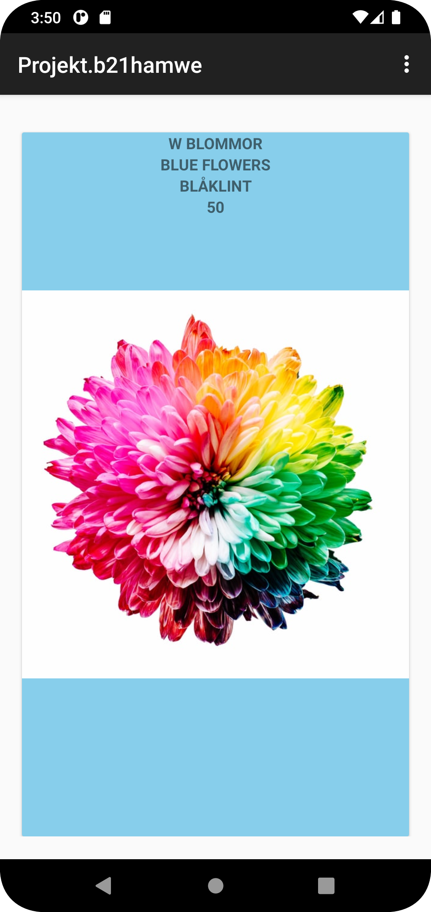
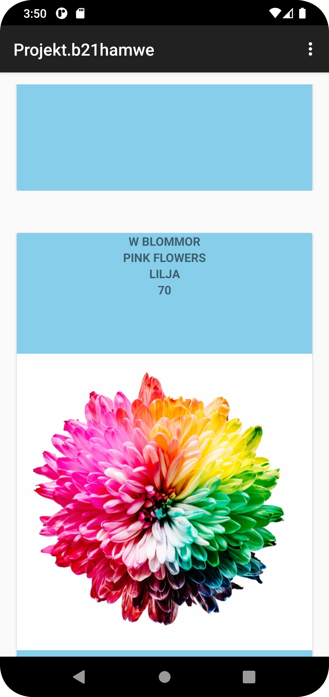
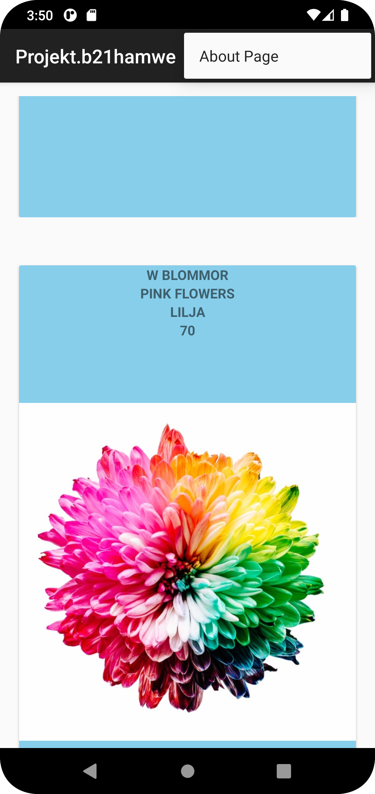
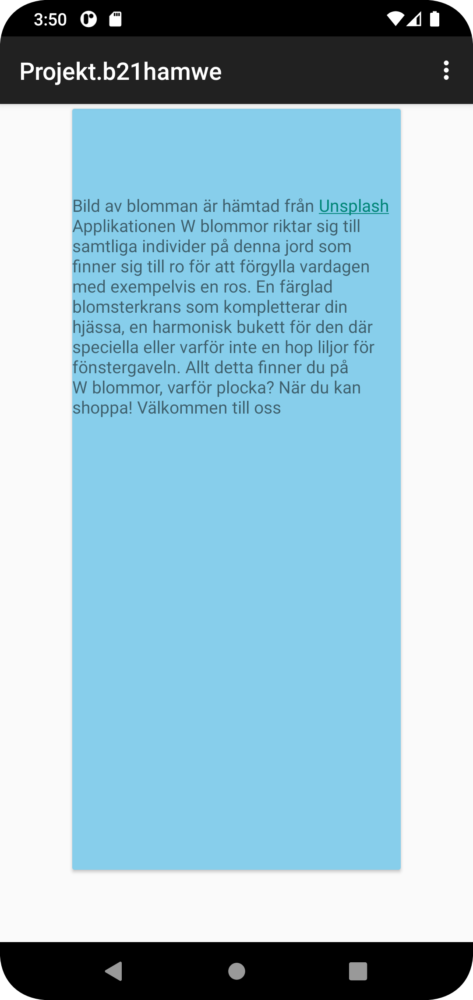

Rapport för projekt i Programmering av mobila applikationer
Hampus Wetterlind, b21hamwe, Webug21


Aktiviteten MainActivity
I aktiviteten MainActivity påbörjar vi med att skapa privata member variabler, dessa variabler används sedan i funktioner.
För att hämta Json datan så använde jag mig utav en recyclerView tillsammans med enstaka rader koder som 
hämtar datan från webbsidan (Rad 14,15,18). 
För att byta mellan menyn där vi kan välja mellan landningsidan samt about sidan har jag använt mig av intents (Rad 29).
```
private ArrayList<Blommor> blommorList;
    private RecyclerView recyclerView;
    private Adapter adapter;
    
    private final String JSON_URL = "https://mobprog.webug.se/json-api?login=b21hamwe";
    new JsonTask(this).execute(JSON_URL);
    
    @Override
    public void onPostExecute(String json) {
        Gson gson = new Gson();
        Type type = new TypeToken<List<Blommor>>() {
        }.getType();

        List<Blommor> listOfblommorList = gson.fromJson(json, type);
        adapter.setblommorList(listOfblommorList);
        adapter.notifyDataSetChanged();


@Override
    public boolean onOptionsItemSelected(MenuItem item) {
        // Handle action bar item clicks here. The action bar will
        // automatically handle clicks on the Home/Up button, so long
        // as you specify a parent activity in AndroidManifest.xml.
        int id = item.getItemId();


        if (id == R.id.action_internal_web) {

            Intent intent = new Intent(MainActivity.this, About.class);
            startActivity(intent);

            return true;
        }

    }

``` 


Klassen Viewholder
I klassen Viewholder så har vi värden för datan som vi hämtar från klassen Adapter som sedan 
Viewholder klassen presenterar i dess layout fil "item_holder.xml". Detta presenteras sedan
visuelt i xml filen item.holder där vi även har skapat en layout eller design för hur applikationen ska se ut. 

```
public ViewHolder(@NonNull View itemView) {
        super(itemView);

        name = itemView.findViewById(R.id.nameprint);
        size = itemView.findViewById(R.id.sizeprint);
        company = itemView.findViewById(R.id.companyprint);
        id = itemView.findViewById(R.id.IDprint);
    }
```

Klassen Adapter
Adaptern ger Viewholder klassen data, men datan som klassen adapter hämtar kommer inte från tomma intet, 
utan från klassen Blommor som säger hämta och returnerar denna data. 
```
@NonNull
    @Override
    public ViewHolder onCreateViewHolder(@NonNull ViewGroup parent, int viewType) {
        return new ViewHolder((LayoutInflater.from(parent.getContext()).inflate(R.layout.item_holder, parent, false)));
    }

    @Override
    public void onBindViewHolder(@NonNull ViewHolder holder, int position) {

        Blommor blommor = blommorList.get(position);

        holder.name.setText(blommor.name);
        holder.size.setText(String.valueOf(blommor.getSize()));
        holder.company.setText(blommor.company);
        holder.id.setText(blommor.getID());
    }
``` 
Klasseb JsonTask
Klassen JsonTask gör det möjligt för applikationen att hämta data via Json
```
@SuppressWarnings("deprecation")
    public JsonTask(JsonTaskListener listener) {
        this.listener = listener;
    }

    protected String doInBackground(String... params) {
        try {
            URL url = new URL(params[0]);
            connection = (HttpURLConnection) url.openConnection();
            connection.connect();
```

Klassen Blommor
Klassen blommor returnerar datan som hämtas via MainActivity och ger denna data till Adaptern som sedan
presenteras via Viewholdern. 
```
public String getName() {
                return name;
        }

        public void setName(String blomma) {
                this.name = blomma;
        }
```
Aktiviteten About
Aktiviteten About är till för att skapa en intern sida som ett komplement för våran landningsida, då man 
via en toolbar meny kan klicka sig in en About sida som har lite förklarande text om applikationen, dess målgrupp samt
länk till licensen för bilden som används i applikationen. Layouten för About sidan presenteras via xml filen activity_about.xml. 
Man kan byta mellan sidorna med hjälp av intents (Rad 128). 
```
@Override
    protected void onCreate(Bundle savedInstanceState) {
        super.onCreate(savedInstanceState);
        setContentView(R.layout.activity_about);
        Toolbar toolbar = findViewById(R.id.toolbar);
        setSupportActionBar(toolbar);
        
        if (id == R.id.close_internal_web) {

            Intent intent = new Intent(About.this, MainActivity.class);
            startActivity(intent);
            return true;
        }
```
XML file meny samt close_meny
Har en xml layout fil som är kopplad till "onCreateOptionsMenu" som skapar layouten för toolbaren. 
Det existerar två av dessa xml filer, en för landningsidan samt en för About sidan. 



